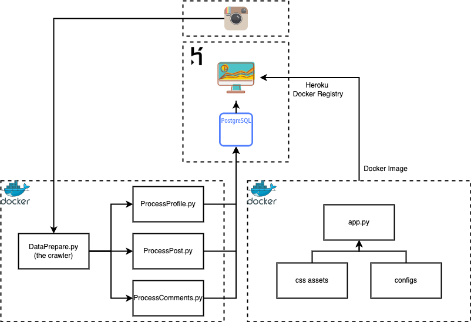

# instagram-kol-analysis

## Introduction

This is a project that seeks to analyze on several Instagram's KOls with Dash visualization as website. I picked 7 "Parent-child" KOLs as reference and captures their profile, posts, and comments. The purpose it to find potential success factors or characteristics to become a famous KOL. The term famous here means KOL with more averge likes per followers (followers / average likes on recent 10 posts). I wrapped up all the files by Docker image and used Heorku Docker Registry to deploy the App.

## App Link

[**https://wjp-dash-app.herokuapp.com/**](https://wjp-dash-app.herokuapp.com/)

## Prequisities

1. Python: This is the core programming I used. Here are listing packages you need:

```python
cryptography==35.0.0
flake8==3.8.3
Flask==1.1.2
pandas==1.0.5
scipy==1.5.0
SQLAlchemy==1.4.25
psycopg2-binary==2.9.0
instagram-scraper==1.10.2
PyYAML==6.0
black==21.10b0
dash==2.0.0 
dash-bootstrap-components==1.0.0 
scikit-learn==0.24.2
gunicorn==20.1.0
```

2. Shell: This is to run `instagram-scraper` using Python `subprocess` to interact with the terminal

3. Heroku PostgresSQL: This is here I stored the processed data

4. Heroku CLI: This is the tool that helps me to push image and make the app release

5. Docker: I developed all components using Docker as well as the deployment on Heroku.

## Workflow

The process are divided into several sections:

1. Use the Instagram crawler get posts from posters then process the data into dataframes.

2. Setup a Heroku account. Then, setup Heroku PostgresSQL and design data model according to the dataframes. Use SQL Alchemy and pandas to load the table into postgres database.

3. Load the required part of data from Heroku PostgresSQL and utilize Dash for data visualization.

4. Setup another app on Heroku and this will be the place where the app is launched. Package up the code with Dockerfile then build Docker images. Push the image to Heorku Docker Registry using Heroku CLI and set to "web" type.

5. Release pushed image with Heroku CLI and finish the deployment on Heroku.



## Database Design
